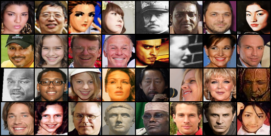

# SN-GAN
pyTorch implementation of Spectral Normalization for Generative Adversarial Networks

--------------------
[SDGAN]:(https://arxiv.org/abs/1705.07904)

1. Result of SN-GAN on MS-Celeba_1M

* Generated

* Real

