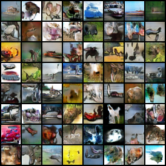
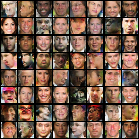

# SN-GAN
pyTorch implementation of Spectral Normalization for Generative Adversarial Networks

--------------------
[SNGAN]:(https://openreview.net/pdf?id=B1QRgziT-)

1. Result of SN-GAN on CIFAR10 dataset

* Generated

* Generated

