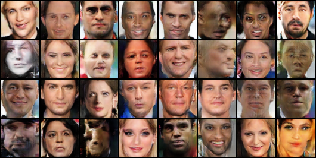

# SN-GAN
PyTorch implementation of [Spectral Normalization for Generative Adversarial Networks](https://openreview.net/pdf?id=B1QRgziT-)

## Prerequistes
* Python 2.7 or Python 3.4+
* [PyTorch](http://pytorch.org/)
* [Numpy](http://www.numpy.org/)

## Usage

- Clone this repo:
```bash
git clone https://github.com/godisboy/SN-GAN.git
cd SN-GAN
```
- Train the standard model for 32*32 image size 
```bash
python train.py --cuda(optional) 
```
- Train the Res-Generator and Res-Discriminator for 64*64 image size
```bash
python train-res.py --cuda --dataPath /Path/to/yourdataset/
```

--------------------
[SNGAN]:(https://openreview.net/pdf?id=B1QRgziT-)

1. Result of SN-GAN on CIFAR10 dataset
* Generated


* Generated


* Generated samples with Standard Generator and ResDiscriminator



**Note**:
The ResBlock of Res-Generator is different from what implemented in original paper.
This repo use `UpsamplingBilinear` instead of `Uppooling` for Upsampling operation.

## To Do
- Conditional version of SNGAN with [Conditional BatchNormalization](https://arxiv.org/pdf/1707.03017.pdf)
- ImageNet 1000 classes
- Latent Inference
- ...
## Acknowledgments
Based on the implementation [DCGAN](https://github.com/pytorch/examples/tree/master/dcgan) and official implementation with [Chainer](https://chainer.org/) [sngan_projection](https://github.com/pfnet-research/sngan_projection)
